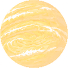

# New Worlds

> A pixel-art spacefaring roguelike built around accurate Newtonian physics.

**New Worlds** is a space exploration roguelike where getting from A to B means understanding the physics of the world around you.

Rather than flying spaceships with conventional arcade controls, New Worlds treats space as space: **momentum matters, gravity matters, and every burn changes your trajectory**.

The project is currently in an early proof-of-concept stage, focused on validating the core flight and orbital mechanics.

---

## Table of Contents

* [Overview](#overview)
* [Current State](#current-state)
* [Core Idea](#core-idea)
* [Newtonian Flight](#newtonian-flight)
* [Gameplay](#gameplay)
* [Visual Style](#visual-style)
* [Controls](#controls)
* [Roadmap](#roadmap)
* [Project Status](#project-status)

---

## Overview

Space games often simplify movement to make spacecraft behave like aircraft: point the ship where you want to go, accelerate, and stop when you reach your destination.

New Worlds takes the opposite approach.

Your spacecraft has **velocity and momentum**. There is no magical braking system and no requirement that the ship always travel in the direction it is facing. Once you're moving, you're moving.

Gravity then complicates things further.

A planetary system isn't simply a collection of destinations — it is a dynamic environment that can be used to shape your trajectory.

The result is intended to make relatively simple actions such as:

> *"I want to get over there."*

into interesting physics problems:

> *"How do I get over there without spending all my fuel?"*

---

## Core Idea

The central design principle is simple:

### **Make the physics the gameplay.**

New Worlds aims to build a roguelike around the consequences of realistic movement rather than treating physics as something happening underneath the game.

That means:

* **Momentum is persistent**
* **Acceleration changes velocity rather than position directly**
* **Gravity affects trajectories**
* **Orbital motion emerges naturally from the simulation**
* **Course corrections have consequences**
* **Efficient flight requires planning**
* **Mistakes can leave you on a very different trajectory than intended**

The goal isn't to turn the game into a physics simulator for its own sake.

The goal is to make **understanding the physics an intuitive and rewarding part of playing the game**.

---

## Newtonian Flight

At the heart of New Worlds is a Newtonian physics simulation.

The spacecraft isn't simply moved towards a target each frame. Instead, its velocity is integrated over time while gravitational forces from relevant bodies influence its acceleration.

This allows trajectories such as:

* Direct transfers
* Planetary orbits
* Escape trajectories
* Gravity-assisted manoeuvres
* Long ballistic flights
* Deliberate braking burns
* Unplanned trajectories caused by poor manoeuvres

to emerge from the same underlying rules.

### Trajectory Prediction

The game can project the spacecraft's current trajectory into the future, giving the player a visual indication of where their current velocity and gravitational influences will take them.

This turns navigation into a question of **prediction and correction**, rather than simply pointing at a destination.

The trajectory shown in the current prototype is deliberately prominent: the player should be able to understand the consequences of a manoeuvre without needing to mentally calculate the orbital mechanics themselves.

---

## Gameplay

The long-term goal is to combine the physics simulation with roguelike exploration.

The player should gradually move through increasingly complex environments where every journey presents a combination of:

* Navigation
* Resource management
* Risk
* Exploration
* Planning
* Physics

A successful journey isn't necessarily the fastest journey.

It may instead be the one that:

* uses the least fuel,
* takes advantage of a planet's gravity,
* avoids dangerous trajectories,
* arrives with enough resources to continue,
* or simply manages to get home.

The exact progression and systemic gameplay are still being developed.

---

## Controls

The current prototype uses keyboard controls:

| Key       | Action                            |
| ----------| --------------------------------- |
| `W`/Up    | Thrust / accelerate               |
| `A`/Left  | Rotate / manoeuvre left           |
| `D`/Right | Rotate / manoeuvre right          |
| `S`/Down  | Reverse thrust / decelerate       |
| `R`       | Reset simulation                  |

The control scheme is intentionally simple. The complexity comes from **what those inputs do to the spacecraft's trajectory**, rather than from having a large number of controls.

---

## Current Prototype

The current proof of concept demonstrates the basic interaction between:

1. A spacecraft
2. A planetary body
3. Gravitational influence
4. Player-controlled acceleration
5. Persistent velocity
6. Predicted trajectories
7. Navigation towards a target

The prototype is already capable of producing trajectories that visually communicate the consequences of player input.

For example, a spacecraft can begin in orbit around a planet, perform a burn, and subsequently depart onto a new trajectory.

The current visuals are prototype-quality. The focus at this stage is on validating the **feel and correctness of the underlying simulation** before building the larger game around it.

---

## Roadmap

New Worlds is currently an experimental project, so the roadmap is intentionally flexible.

### Physics

* [x] Basic Newtonian movement
* [x] Velocity-based flight
* [x] Gravitational influence
* [x] Orbital trajectories
* [x] Predicted trajectory visualisation
* [x] Multiple gravitational bodies
* [x] Lagrange points

### Gameplay

* [x] Docking
* [ ] Exploration
* [ ] Resource and fuel management
* [ ] Economy
* [ ] Crew
* [ ] NPCs
* [ ] Quests and Missions
* [ ] Ship upgrades
* [ ] Progression

### World

* [/] Multiple planets
* [/] Moons
* [/] Different planetary types
* [ ] Procedurally generated planetary systems
* [ ] Points of interest
* [ ] Discoverable locations

### Presentation

* [x] Initial pixel-art visual direction
* [x] Minimal space backdrop
* [x] Basic trajectory visualisation
* [/] Expanded sprite library
* [ ] Ship sprites and animation
* [ ] Effects and feedback
* [/] Sound
* [ ] Music

---

The intention is to avoid building a large amount of game content around mechanics that haven't yet been proven to be fun.

---

## Project Status

**Early proof of concept**

The current priority is validating the central idea:

> **Is a roguelike built around Newtonian spaceflight actually fun to play?**

The prototype exists to answer that question.

Expect incomplete systems, placeholder assets, changing mechanics and potentially significant architectural changes while the core concept is developed.

---
